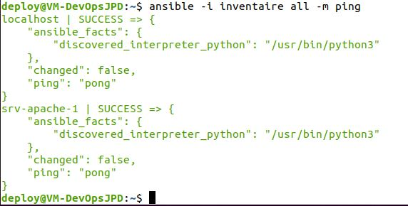
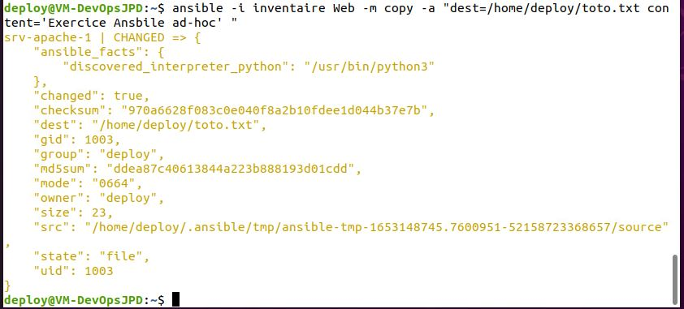
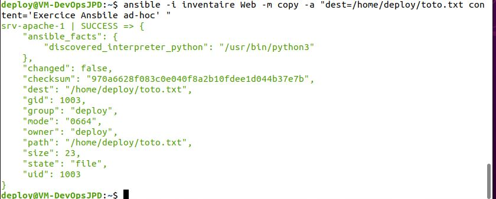

# Exercice 21 - Ansible  - Mode ad hoc

- Environnement : vSphere
- Temps de réalisation : 3 heures

Dans cet exercice, nous allons utiliser Ansible sur des machines distantes en mode ad hoc.
Le mode ad hoc est en général utilisé dans ces situations :
- Test de module
- Lancement de tâche rapidement

 Voici les tâches à réaliser dans cet exercice :

  - Modifier le fichier d'inventaire 
  - utilisez une commande ad hoc pour tenter de rejoindre le/les clients Ansible
  - Utilisez la commande ad hoc pour créer un fichier toto.txt avec le contenu "Exercice Ansible ad hoc" qui se trouvera sur les clients, et ce, dans le dossier /home/deploy/toto.txt 
  - Vérifier que le fichier a bien été créé avec le contenu
  - Rajoutez un client et modifiez le fichier inventaire afin de rajouter le nouveau client (Ubuntu ou CentOS).
  - Relancez l'action ping et de création de fichiers sur les clients.
 - Vérifier le résultat
 - Testez l'effet du module "setup" sur votre inventaire.


## Sur votre machine de contrôle 

Modifier le fichier d'inventaire pour ne plus avoir d'erreurs sur localhost.

```bash
su deploy
cd
pwd
ansible --version
vim inventaire
```

Contenu du fichier inventaire

```
[Web]
srv-apache-1 ansible_user=deploy ansible_host=X.X.X.X # IP de votre hôte

[local]
control ansible_connection=local

```

**Attention** : le paramètre <code>ansible_user</code> n'est pas nécessaire, car nous l'avons déjà défini dans le fichier ansible.cfg.

Vérifier le contenu du fichier

```
cat inventaire
```

Maintenant, nous pouvons faire les commandes ad hoc :  
**Attention** : comme le fichier inventaire est défini dans le fichier ansible.cfg le paramètre <code>-i</code> n'est pas nécessaire.

```bash
# Syntaxe :
# Ansible -i[ fichier inventaire] [groupe de machine dans le fichier d'inventaire] -m [module]
ansible all -m ping
```

Sortie : 




Maintenant, utilisons le module  [Copy](https://docs.ansible.com/ansible/latest/collections/ansible/builtin/copy_module.html). Mais seulement sur la machine srv-apache-1 qui est dans le groupe Web :

```bash
ansible Web -m copy -a "dest=/home/deploy/toto.txt content='Exercice Ansible ad hoc'"
```

Sortie :



### Sur votre machine cliente (srv-apache-1)

```
sudo su deploy
cd 
pwd
ls 
cat toto.txt
```


## Sur votre machine de contrôle

Exécutez à nouveau la commande :

```bash
ansible Web -m copy -a "dest=/home/deploy/toto.txt content='Exercice Ansible ad hoc'"
```

Remarquez les changements (ou non-changement) au niveau changed:



Si nous avions fait une copie avec scp, quelle aurait été la situation ?

Vous pouvez le tester : 

```bash
vim toto.txt # Aujoutez le contenu
scp toto.txt srv-apache-1:/home/deploy/toto.txt
```

Le fichier va écraser l'autre. Ansible lui voit que c'est le même contenu donc ne fait rien.

Essayer à nouveau avec :

```bash
ansible -i inventaire Web -m copy -a "dest=/home/deploy/toto.txt content='Exercice Ansible ad hoc v2'"
```

Ansible a modifié le fichier.

À nouveau avec la même commande :

```bash
ansible Web -m copy -a "dest=/home/deploy/toto.txt content='Exercice Ansible ad hoc v2'"
```

Rien n'a changé (changed:false)
Essayer à nouveau avec ceci :

```bash
ansible Web -m copy -a "dest=/home/deploy/toto.txt content='Exercice Ansible ad hoc v3'"
```

Le fichier a changé (changed:true)

Il exécute le changement seulement s’il y a changement. Alors que scp vas nécessairement écraser le fichier.

## Il s'agit ici de la notion d'**idempotence** : 

Un logiciel idempotent produit le même résultat souhaitable chaque fois qu'il est exécuté. 
Dans un logiciel de déploiement, l'idempotence permet la convergence et la composabilité et permet de :  
Rassembler plus facilement des composants dans des collections qui créent de nouveaux types d'infrastructure et effectuent de nouvelles tâches opérationnelles.
Exécuter des collections complètes de développement/déploiement pour réparer en toute sécurité les petits problèmes d'infrastructure, effectuer des mises à niveau progressives, modifier la configuration ou gérer la mise à l'échelle. 

# Ajouter le nouveau client (CentOS)

Utiliser le template suivant pour créer la seconde machine :

- Allez dans le dossier :
DFC DS -> VM DFC -> Modeles -> Production -> TPL_20210520_CentOsStream9
- Sélectionnez le modèle de VM et cliquez sur le bouton droit de votre souris et sélectionnez Nouvelle VM à partir de ce modèle...
- Suivez les étapes 
    - Nom de la VM : srv-mysql-[matricule]
    - Emplacement : DFC DS -> VM DFC -> A22_4394_420W45_ISS_JPD
    - Stockage : SAN-DFC
    
- Après votre connexion, changer les informations suivantes 

    - Nom de la machine (<code>sudo hostnamectl set-hostname srv-mysql-1</code>) : srv-mysql-1.
    - Renseignez le fichier <code>/etc/hosts</code> pour qu'il prenne en considération la modification.
    - Créer un compte : deploy avec le même mot de passe que sur votre machine de contrôle.
    - Membre des groupes sudo et adm.


```bash
 sudo adduser deploy 
 sudo usermod -aG adm  deploy
 sudo passwd deploy 
 # Confirmer nouveau mot de passe.
 su deploy # se connecter avec deploy
```

## Machine de contrôle 

- Copier la clé ssh sur la machine srv-mysql-[matricule] (Voir exercice 17)

- Ajouter la machine à l'inventaire :

```bash
vim inventaire

#contenu du fichier inventaire :
[Mysql]
srv-mysql-1 ansible_host=X.X.X.X # IP de votre hôte

[Web]
srv-apache-1 ansible_host=X.X.X.X # IP de votre hôte

[local]
control ansible_connection=local

```

Vérifiez la connectivité.

```bash
ansible all -m ping
```


Refaites la copie 

```bash
ansible all -m copy -a "dest=/home/deploy/toto.txt content='Exercice Ansible ad hoc v3'"
```

## Attention  : 

Avertissement: 
- Ansible fait le travail sur localhost avec changed=true
- Ansible fait le travail sur srv-apache avec changed=false
- Ansible fait aussi le travail sur le srv-mysql avec change=true
- Mais il affiche un avertissement de dépréciation pour notre machine CentOs.


**Pour corriger le problème**

Modifier votre fichier d'inventaire à la ligne srv-mysql-1 de la façon suivante :

```bash
srv-mysql-1 ansible_python_interpreter=/usr/bin/python3 ansible_host=X.X.X.X # IP de votre hôte
```

Ce problème est bien décrit dans la documentation d’Ansible :
https://docs.ansible.com/ansible/latest/reference_appendices/python_3_support.html


Refaites la commande :

```bash
ansible all -m copy -a "dest=/home/deploy/toto.txt content='Exercice Ansible ad hoc v3'"
```

Voici de nouveau la sortie sans avertissement et avec bien sûr, les changed : false:


**Attention : gardez une capture pour votre remise.**


# Ansible  - Mode ad hoc avec format YAML

Dans cette partie de l'exercice, nous allons utiliser Ansible sur des machines distantes en mode ad hoc mais cette fois, avec un inventaire au format YAML.
 
## Sur votre machine avec de contrôle 

A l'aide de l'éditeur de votre choix, reproduire le fichier d'inventaire en format YAML.
Vous pouvez vous aidez avec la [documentation](https://docs.ansible.com/ansible/latest/user_guide/intro_inventory.html).

```
cat inventaire.yaml
```

Maintenant, nous pouvons faire les commandes ad hoc:

```bash
ansible -i inventaire.yaml all -m ping
```

**Attention : gardez une capture comme preuve de réalisation.**


# Le module setup

Il scan la machine pour vous donnez l'ensemble des informations à exploiter dans les playbook que nous utiliserons dans le prochain exercice.

Faites la commande :

```bash
ansible all -m setup
```

Comme la sortie est trop imposante, renvoyez-le tous dans un fichier :

```bash
ansible all -m setup > setup.txt
```

Astuce, vous avez probablement remarqué que votre usager deploy ne peut pas utiliser le mode graphique, car nous ne sommes pas connectés avec lui en mode graphique. 

2 options s'offrent à vous : 
  - Connectez-vous avec l'usager deploy en mode graphique.
  - Faite une copie du fichier setup vers votre usager :

```
sudo cp setup.txt /homme/[votreUsager]/setup.txt
```

Remarquer les points suivants pour chacune des machines :
 - Adresse IPv4 et IPv6.
 - Nos distributions : ansible_ditribution.
 - Les variables d'environnement : ansible_env.
 - Plusieurs informations sur les éléments physiques de la machine :
    - Disque dur
    - Mémoire vive 
    - etc.


# Remise

Placer les capture des deux  commandes suivante dans un seul fichier et déposer le sur LÉA dans travaux exercice 21.

```bash
ansible all -m copy -a "dest=/home/deploy/toto.txt content='Exercice Ansible ad hoc v3'"
```

```bash
ansible -i inventaire.yaml all -m ping
```

